# Visualización de datos en Python

# Importar datos


```python
import pandas as pd
```


```python
iris = pd.read_csv('iris.csv')
print(iris)
```

         sepal.length  sepal.width  petal.length  petal.width    variety
    0             5.1          3.5           1.4          0.2     Setosa
    1             4.9          3.0           1.4          0.2     Setosa
    2             4.7          3.2           1.3          0.2     Setosa
    3             4.6          3.1           1.5          0.2     Setosa
    4             5.0          3.6           1.4          0.2     Setosa
    ..            ...          ...           ...          ...        ...
    145           6.7          3.0           5.2          2.3  Virginica
    146           6.3          2.5           5.0          1.9  Virginica
    147           6.5          3.0           5.2          2.0  Virginica
    148           6.2          3.4           5.4          2.3  Virginica
    149           5.9          3.0           5.1          1.8  Virginica
    
    [150 rows x 5 columns]
    


```python
wine_reviews = pd.read_csv('winemag-data-130k-v2.csv', index_col=0)
wine_reviews.head()
```


<div>
<style scoped>
    .dataframe tbody tr th:only-of-type {
        vertical-align: middle;
    }

    .dataframe tbody tr th {
        vertical-align: top;
    }

    .dataframe thead th {
        text-align: right;
    }
</style>
<table border="1" class="dataframe">
  <thead>
    <tr style="text-align: right;">
      <th></th>
      <th>country</th>
      <th>description</th>
      <th>designation</th>
      <th>points</th>
      <th>price</th>
      <th>province</th>
      <th>region_1</th>
      <th>region_2</th>
      <th>taster_name</th>
      <th>taster_twitter_handle</th>
      <th>title</th>
      <th>variety</th>
      <th>winery</th>
    </tr>
  </thead>
  <tbody>
    <tr>
      <th>0</th>
      <td>Italy</td>
      <td>Aromas include tropical fruit, broom, brimston...</td>
      <td>Vulkà Bianco</td>
      <td>87</td>
      <td>NaN</td>
      <td>Sicily &amp; Sardinia</td>
      <td>Etna</td>
      <td>NaN</td>
      <td>Kerin O’Keefe</td>
      <td>@kerinokeefe</td>
      <td>Nicosia 2013 Vulkà Bianco  (Etna)</td>
      <td>White Blend</td>
      <td>Nicosia</td>
    </tr>
    <tr>
      <th>1</th>
      <td>Portugal</td>
      <td>This is ripe and fruity, a wine that is smooth...</td>
      <td>Avidagos</td>
      <td>87</td>
      <td>15.0</td>
      <td>Douro</td>
      <td>NaN</td>
      <td>NaN</td>
      <td>Roger Voss</td>
      <td>@vossroger</td>
      <td>Quinta dos Avidagos 2011 Avidagos Red (Douro)</td>
      <td>Portuguese Red</td>
      <td>Quinta dos Avidagos</td>
    </tr>
    <tr>
      <th>2</th>
      <td>US</td>
      <td>Tart and snappy, the flavors of lime flesh and...</td>
      <td>NaN</td>
      <td>87</td>
      <td>14.0</td>
      <td>Oregon</td>
      <td>Willamette Valley</td>
      <td>Willamette Valley</td>
      <td>Paul Gregutt</td>
      <td>@paulgwine</td>
      <td>Rainstorm 2013 Pinot Gris (Willamette Valley)</td>
      <td>Pinot Gris</td>
      <td>Rainstorm</td>
    </tr>
    <tr>
      <th>3</th>
      <td>US</td>
      <td>Pineapple rind, lemon pith and orange blossom ...</td>
      <td>Reserve Late Harvest</td>
      <td>87</td>
      <td>13.0</td>
      <td>Michigan</td>
      <td>Lake Michigan Shore</td>
      <td>NaN</td>
      <td>Alexander Peartree</td>
      <td>NaN</td>
      <td>St. Julian 2013 Reserve Late Harvest Riesling ...</td>
      <td>Riesling</td>
      <td>St. Julian</td>
    </tr>
    <tr>
      <th>4</th>
      <td>US</td>
      <td>Much like the regular bottling from 2012, this...</td>
      <td>Vintner's Reserve Wild Child Block</td>
      <td>87</td>
      <td>65.0</td>
      <td>Oregon</td>
      <td>Willamette Valley</td>
      <td>Willamette Valley</td>
      <td>Paul Gregutt</td>
      <td>@paulgwine</td>
      <td>Sweet Cheeks 2012 Vintner's Reserve Wild Child...</td>
      <td>Pinot Noir</td>
      <td>Sweet Cheeks</td>
    </tr>
  </tbody>
</table>
</div>


# Matplotlib


```python
#Instalación de Matplotlib

## pip install matplotlib

## conda install matplotlib
```


```python
import matplotlib.pyplot as plt
```


```python
# create a figure and axis
fig, ax = plt.subplots()

# scatter the sepal_length against the sepal_width
ax.scatter(iris['sepal.length'], iris['sepal.width'])

# set a title and labels
ax.set_title('Iris Dataset')
ax.set_xlabel('sepal.length')
ax.set_ylabel('sepal.width')
```


    Text(0, 0.5, 'sepal.width')


    
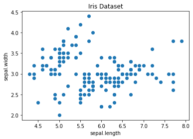
    


More meaning by coloring in each data-point by its class


```python
# create color dictionary
colors = {'Setosa':'r', 'Versicolor':'g', 'Virginica':'b'}

# create a figure and axis
fig, ax = plt.subplots()

# plot each data-point
for i in range(len(iris['sepal.length'])):
    ax.scatter(iris['sepal.length'][i], iris['sepal.width'][i],color=colors[iris['variety'][i]])
    
# set a title and labels
ax.set_title('Iris Dataset')
ax.set_xlabel('sepal.length')
ax.set_ylabel('sepal.width')
```


    Text(0, 0.5, 'sepal.width')


    
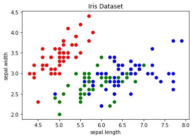
    


```python
#Line Chart
```


```python
# get columns to plot
columns = iris.columns.drop(['variety'])

# create x data
x_data = range(0, iris.shape[0])

# create figure and axis
fig, ax = plt.subplots()

# plot each column
for column in columns:
    ax.plot(x_data, iris[column], label=column)
    
# set title and legend
ax.set_title('Iris Dataset')
ax.legend()
```


    <matplotlib.legend.Legend at 0x1c0854f0c10>


    
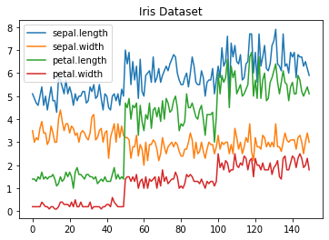
    


```python
#Histogram
```


```python
# create figure and axis
fig, ax = plt.subplots()

# plot histogram
ax.hist(wine_reviews['points'])

# set title and labels
ax.set_title('Wine Review Scores')
ax.set_xlabel('Points')
ax.set_ylabel('Frequency')
```


    Text(0, 0.5, 'Frequency')


    
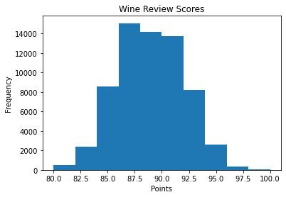
    


```python
#Bar Chart
```


```python
# create a figure and axis 
fig, ax = plt.subplots() 

# count the occurrence of each class 
data = wine_reviews['points'].value_counts() 

# get x and y data 
points = data.index 
frequency = data.values 

# create bar chart 
ax.bar(points, frequency) 

# set title and labels 
ax.set_title('Wine Review Scores') 
ax.set_xlabel('Points') 
ax.set_ylabel('Frequency')
```


    Text(0, 0.5, 'Frequency')


    
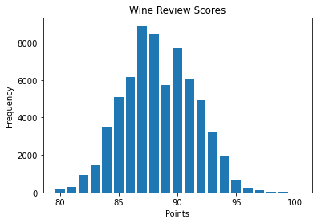
    


# Pandas Visualization


```python
## Instalación
## pip install pandas
## or
## conda install pandas
```


```python
import pandas as pd
```


```python
#Scatter Plot
```


```python
iris.plot.scatter(x='sepal.length', y='sepal.width', title='Iris Dataset')
plt.show()
```


    
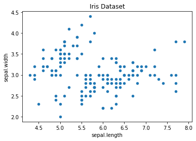
    


```python
#Line Chart
```


```python
iris.drop(['variety'], axis=1).plot.line(title='Iris Dataset')
plt.show()
```


    

    


```python
##Histogram
```


```python
wine_reviews['points'].plot.hist()
plt.show()
```


    
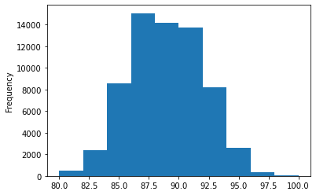
    


```python
#Create multiple histograms.
```


```python
iris.plot.hist(subplots=True, layout=(2,2), figsize=(10, 10), bins=100)
plt.show()
```


    
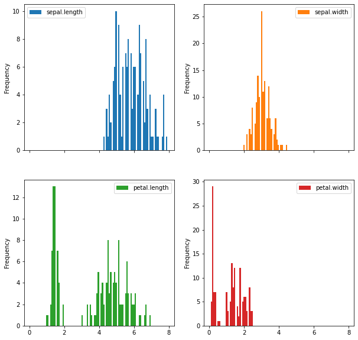
    


```python
#Bar Chart
```


```python
wine_reviews['points'].value_counts().sort_index().plot.barh()
plt.show()
```


    
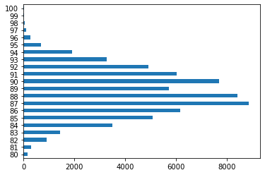
    


```python
wine_reviews.groupby("country").price.mean().sort_values(ascending=False)[:10].plot.bar()
plt.show()
```


    
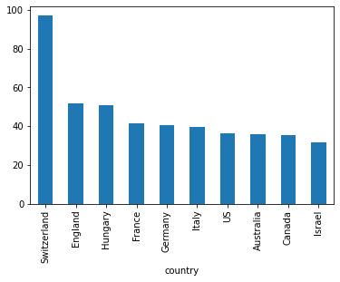
    


# Seaborn


```python
import seaborn as sns
```


```python
sns.scatterplot(x='sepal.length', y='sepal.width', data=iris)
plt.show()
```


    
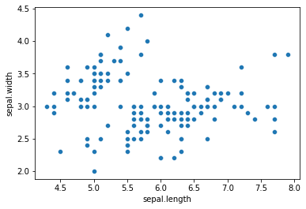
    


```python
sns.scatterplot(x='sepal.length', y='sepal.width', hue='variety', data=iris)
plt.show()
```


    
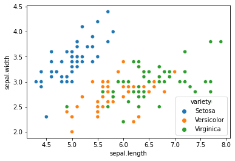
    


```python
sns.lineplot(data=iris.drop(['variety'], axis=1))
plt.show()
```


    
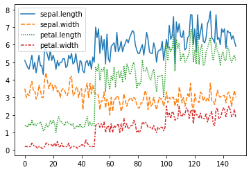